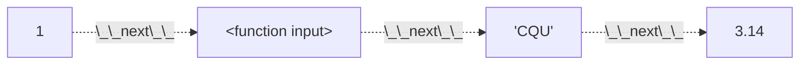

# Python 期末复习串讲

茵符草 | Chongqing University  
[CQU-openlib](https://cqu-openlib.cn) 站长  

2025-1-2

<div class="abs-br m-6 text-xl">
  <a href="https://github.com/INFO-studio" target="_blank" class="slidev-icon-btn">
    <carbon:logo-github />
  </a>
</div>

<style>
h1 {
    background-color: #2B90B6;
    background-image: linear-gradient(45deg, #4EC5D4 10%,#58b7dd 20%);
    background-size: 100%;
    -webkit-background-clip: text;
    -moz-background-clip: text;
    -webkit-text-fill-color: transparent;
    -moz-text-fill-color: transparent;
}
</style>

---
hideInToc: true
---

# 目录

<Toc minDepth="1" maxDepth="1" />

---

# 赋值

<div style="font-size: 3em;">
<pre><code>
a = 1
</code></pre>
</div>

<div style="font-size: 3em;">
<pre><code>
变量名 = 值
</code></pre>
</div>

---

# 基础变量
1. 数
2. 字符串
3. 布尔值

---
level: 2
clicks: 6
---

# 基础变量

### 1. 数

定义
<div class="grid grid-cols-2 m-4">
<div v-click='1' class="m-2">
整数

```py
a = 1
b = 2
c = 1001001002
```
</div>

<div v-click='2' class="m-2">
浮点数（小数）

```py
a = 1.1
b = 2.0
c = 4.12121212112112
```
</div>
</div>

<div v-click='3'>运算法则</div>
<div v-if="$route.query.clicks <=5" v-click='4' class="grid grid-cols-2 m-4">
<div class="m-2">
```py
a = 1
b = 2.3
c = a + b        # 加法
d = 2 * (a * b)  # 乘法
e = a / b        # 普通除法
f = a // b       # 整除
g = b % a        # 取余
h = b ** 3       # 乘方
```
</div>
<div class="m-2">
<div v-if="$route.query.clicks <=4">
```
| a : 1
| b : 2.3
| c : 3.3
| d : 4.6
| e : 0.4347826086956522
| f : 0.0
| g : 0.3
| h : 5.29
```
</div>
<div v-else>
```
| a : 1
| b : 2.3
| c : 3.3
| d : 4.6
| e : 0.4347826086956522
| f : 0.0
| g : 0.2999999999999998
| h : 5.289999999999999
```
</div>
</div>
</div>
<div v-else v-click='4' class="grid grid-cols-2 m-4">
<div class="m-2">
```py
a = 1
b = 2.3
a += b           # 自加法   等价 a = a + b
a -= 0.5 * b     # 自加法   等价 a = a - (0.5 * b)
a *= 1 + b       # 自乘法   等价 a = a * (1 + b)
a /= 0.9 ** b    # 自除法   等价 a = a / (0.9 ** b)
a //= 0.5 / b    # 自整除   等价 a = a // (0.5 / b)
a %= b           # 自取余   等价 a = a % b
```
</div>
<div class="m-2">
```
| a : 1
| b : 2.3
| a : 3.3
| a : 2.15
| a : 7.095
| a : 9.0405453293247
| a : 41.0
| a : 1.900000000000003
```
</div>
</div>

---
level: 2
---

# 基础变量
### 1. 数
变换关系
<div v-click='1' class="grid grid-cols-2">
<div class="m-2">
```py
a1 = 3
b1 = 4.5
c1 = float(a)         # 整数转小数
d1 = int(b)           # 小数向0取整
e1 = round(b)         # 小数「4舍6入5凑偶」取整
```
</div>
<div class="m-2">
```
| a1 : 3
| b1 : 4.5
| c1 : 3.0
| d1 : 4
| e1 : 4
```
</div>
</div>

<div v-click='2' class="grid grid-cols-2">
<div class="m-2">
```py
a2 = round(1.1)       # 4舍
b2 = round(1.5)       # 5凑偶
c2 = round(1.6)       # 6入
d2 = round(-4.5)      # 5凑偶
```
</div>
<div class="m-2">
```
| a2 : 1
| b2 : 2
| c2 : 2
| d2 : -4
```
</div>
</div>

<div v-click='3' class="grid grid-cols-2">
<div class="m-2">
```py
import math
a3 = math.floor(2.7)  # 向下取整 
b3 = math.ceil(2.2)   # 向上取整
```
</div>
<div class="m-2">
```
# 导入math库
| a3 : 2
| b3 : 3
```
</div>
</div>

---
level: 2
---

# 基础变量
### 2. 字符串
定义
<div class="grid grid-cols-2 m-4">
<div v-click='1' class="m-2">
单行

```py
a = '我是CQUer'
b = "你好"
c = “这样不可以！”  # 会报错的
```
</div>

<div v-click='2' class="m-2">
多行

```py
a = """
这是多行字符串
"""
```
</div>
</div>
<div v-click='3'>运算法则</div>
<div v-click='4' class="grid grid-cols-2 m-4">
<div class="m-2">
```py
a = '我是CQUer'
b = "你好"
c = a + ' haha ' + b  # 拼接
d = b * 3             # 重复
```
</div>

<div class="m-2">
```
| a : '我是CQUer'
| b : '你好'
| c : '我是CQUer haha 你好'
| d : '你好你好你好'
```
</div>
</div>

---
level: 2
---

# 基础变量
### 2. 字符串
转义字符
<div v-click='1' class="grid grid-cols-2 m-4">
<div class="m-2">
```py
'\n'
'\t'
'\''
'\"'
'\\'
```
</div>
<div class="m-2">
```
换行
制表符
单引号'
双引号"
斜杠\
```
</div>
</div>

<div v-click='2' class="m-4 mb-2">
<div class="m-2">
转义主要是为了避免如下的问题
</div>
<div class="grid grid-cols-3">
<div v-if="$route.query.clicks <=3" v-click='3' class="m-2">
```
'I'm CQUer'
```
</div>
<div v-else-if="$route.query.clicks <=4" v-click='3' class="m-2">
```
"I'm CQUer"
```
</div>
<div v-else v-click='3' class="m-2">
```
'I\'m CQUer'
```
</div>
<div v-if="$route.query.clicks <=6" v-click='6' class="m-2">
```
"He said: "That's amazing.""
```
</div>
<div v-else v-click='6' class="m-2">
```
"He said: \"That\'s amazing.\""
```
</div>
<div v-if="$route.query.clicks <=8" v-click='8' class="m-2">
```
""""""xxx"""这是多行字符串"""
```
</div>
<div v-else-if="$route.query.clicks <=9" v-click='8' class="m-2">
```
'''"""xxx"""这是多行字符串'''
```
</div>
<div v-else v-click='8' class="m-2">
```
"""\"\"\"xxx\"\"\"这是多行字符串"""
```
</div>
</div>
</div>

<div v-click='11' class="m-6 mt-0">
制表符是一种比较特殊的转义字符，会采取「向上取整到4」策略  
```
how\tto\tuse\\t:\tlike\tthis
how to  use\t:  like    this
123456789012345678901234
```
</div>

---
level: 2
clicks: 6
---

# 基础变量
### 3. 布尔值
定义
<div class="grid grid-cols-2 m-4">
<div v-click='1' class="m-2">
真

```py
a = True
```
</div>

<div v-click='2' class="m-2">
假

```py
b = False
```
</div>
</div>
<div v-click='3'>运算法则</div>
<div v-if="$route.query.clicks <=4" v-click='4' class="grid grid-cols-2 m-4">
<div class="m-2">
```py
a = True
b = False
c = a and b
d = a or b
e = not a
```
</div>

<div class="m-2">
```
| a : True
| b : False
| c : True
| d : False
| e : False
```
</div>
</div>
<div v-else v-click='4' class="grid grid-cols-3 m-4">
<div class="m-2">
「与」运算
```py
True  and True   # True
True  and False  # True
False and True   # True
False and False  # False
```
</div>

<div class="m-2">
「或」运算
```py
True  or True   # True
True  or False  # False
False or True   # False
False or False  # False
```
</div>

<div class="m-2">
「非」运算
```py
not True   # False
not False  # True
```
</div>
</div>

<span v-click='6' class="text-2em text-blue">
优先级 <code>not > and > or</code>
</span>
<span v-click='6' class="text-2em text-red">
别管优先级，好好写括号！
</span>

---
level: 2
---

# 基础变量
### 3. 布尔值

数与字符串的布尔值运算
<div v-click='1' class="grid grid-cols-3">
<div class="m-2">
```py
a1 = 1
b1 = 2
c1 = a1 < b1
d1 = a1 == b1
```
</div>
<div class="m-2">
```
| a1 : 1
| b1 : 2
| c1 : True
| d1 : False
```
</div>
<div class="m-2">
```
a > b  : 若 a 大于 b 则返回True
a < b  : 若 a 小于 b 则返回True
a >= b : 若 a 大于等于 b 则返回True
a <= b : 若 a 小于等于 b 则返回True
a == b : 若 a 等于 b 则返回True
a = b  : 把 b 赋值给 a!!!!
a != b : 若 a 不等于 b 则返回True
```
</div>
</div>

<div v-click='2' class="grid grid-cols-3">
<div class="m-2">
```py
a2 = "CQU"
b2 = "Chongqing University"
c2 = "CQU"
e2 = a < b
f2 = a == b
g2 = a == c
```
</div>
<div class="m-2">
```
| a2 : 'CQU'
| b2 : 'Chongqing University'
| c2 : 'CQU'
| d2 : True
| e2 : False
| f2 : True
```
</div>
<div class="m-2">
```
同上
但是字符串比较大小比较的是「Ascii码」
不需要背这个表，但是需要知道两点：
- 数字 < 大写字母 < 小写字母
- 数字与字母的排列都是连续的
  也就是 f 后面一定是 g 
  3 后面一定是 4
```
</div>
</div>


---

# 输出与输入

### 输出

<div v-click='1' class="grid grid-cols-2">
<div class="m-2">
```py
print("Hello World")
```
</div>
<div class="m-2">
```
$ Hello World
```
</div>
</div>

<div v-click='2' class="grid grid-cols-2">
<div class="m-2">
```py
text = "I'm a text"
print(text)
```
</div>
<div class="m-2">
```
$ I'm a text
```
</div>
</div>

<div v-click='3' class="grid grid-cols-2">
<div class="m-2">
```py
number = 12345
mylist = [111, "word", 'h', 3.14]
print(number, mylist)
```
</div>
<div class="m-2">
```
$ 12345 [111, 'word', 'h', 3.14]
```
</div>
</div>

<div v-click='4' class="grid grid-cols-2">
<div class="m-2">
```py
print('a', 'b', sep='&', end='*')
print('c', 'd', sep='^')
```
</div>
<div class="m-2">
```
$ a&b*c^d
```
</div>
</div>

---
level: 2
---

# 输出与输入

### 输入

<div class="grid grid-cols-3">
<div v-click='1' class="m-2">
```py
a = input()
```
</div>
<div v-if="$route.query.clicks <=2" v-click='2' class="m-2">
```
$
```
</div>
<div v-else v-click='3' class="m-2">
```
$ Hello World
```
</div>
<div v-click='4' class="m-2">
```
| a : 'Hello World'
```
</div>
</div>

<div class="grid grid-cols-3">
<div v-click='5' class="m-2">
```py
a = input("请输入：")
```
</div>
<div v-if="$route.query.clicks <=6" v-click='6' class="m-2">
```
$ 请输入：
```
</div>
<div v-else v-click='7' class="m-2">
```
$ 请输入：Hello World
```
</div>
<div v-click='8' class="m-2">
```
| a : 'Hello World'
```
</div>
</div>

---

# 判断与while循环
### 判断

<div class="grid grid-cols-2">
<div v-click='1' class="m-2">
```py
flag = True
if flag: 
    print("Yes~!")
```
</div>
<div v-click='2' class="m-2">
```
$ Yes~!
```
</div>
</div>

<div class="grid grid-cols-2">
<div v-click='3' class="m-2">
```py
flag = True
if flag: 
    print("Yes~!")
```
</div>
<div v-click='4' class="m-2">
```
$ 
```
</div>
</div>

<div class="grid grid-cols-2">
<div v-click='5' class="m-2">
```py
flag = True
if flag: 
    print("Yes~!")
else:
    print("Oh...no")
```
</div>
<div v-click='6' class="m-2">
```
$ Oh...no
```
</div>
</div>

---
level: 2
---

# 判断与while循环
### 判断

<div class="grid grid-cols-2">
<div v-click='1' class="m-2">
```py
flag = 12
if flag < 10: 
    print("That's so little")
else if flag < 20:
    print("A bit more")
else if flag < 50:
    print("That's enough")
else:
    print("Stop! It's overflowing")
```
</div>
<div v-click='2' class="m-2">
```
$ A little more
```
</div>
</div>

<div class="grid grid-cols-2">
<div v-click='3' class="m-2">
```py
flag = 42
if flag < 10: 
    print("That's so little")
else if flag < 20:
    print("A bit more")
else if flag < 50:
    print("That's enough")
```
</div>
<div v-click='4' class="m-2">
```
$ That's enough
```
</div>
</div>

---
level: 2
clicks: 39
---

# 判断与while循环
### while循环

<div v-click='1' class="grid grid-cols-2">
<div class="m-2">
```py {all|all|1|2|3|4|2|3|4|2|3|4|2|3|4|2|3|4|2|none|all}
flag = 5
while flag > 0:
    print(flag, end = ' ')
    flag -= 1
```
</div>
<div class="grid grid-rows-2">
<div v-if="$route.query.clicks <=1" class="m-2">
```
| 
```
</div>
<div v-else-if="$route.query.clicks <=4" class="m-2">
```
| flag : 5
```
</div>
<div v-else-if="$route.query.clicks <=7" class="m-2">
```
| flag : 4
```
</div>
<div v-else-if="$route.query.clicks <=10" class="m-2">
```
| flag : 3
```
</div>
<div v-else-if="$route.query.clicks <=13" class="m-2">
```
| flag : 2
```
</div>
<div v-else-if="$route.query.clicks <=16" class="m-2">
```
| flag : 1
```
</div>
<div v-else class="m-2">
```
| flag : 0
```
</div>
<div v-if="$route.query.clicks <=3" class="m-2">
```
$
```
</div>
<div v-else-if="$route.query.clicks <=6" class="m-2">
```
$ 5
```
</div>
<div v-else-if="$route.query.clicks <=9" class="m-2">
```
$ 5 4
```
</div>
<div v-else-if="$route.query.clicks <=12" class="m-2">
```
$ 5 4 3
```
</div>
<div v-else-if="$route.query.clicks <=15" class="m-2">
```
$ 5 4 3 2
```
</div>
<div v-else-if="$route.query.clicks <=18" class="m-2">
```
$ 5 4 3 2 1
```
</div>
<div v-else class="m-2">
```
$ 5 4 3 2 1
```
</div>
</div>
</div>

<div class="grid grid-cols-2">
<div v-click='21' class="m-2">
```py
flag = 5
while flag > 0:
    print(flag, end = ' ')
    flag -= 1
else:
    print("\nflag 已经不大于0了喔")
```
</div>
<div v-click='22' class="m-2">
```
$ 5 4 3 2 1
$ flag 已经不大于0了喔
```
</div>
</div>

<div v-click='23' class="grid grid-cols-2">
<div class="m-2">
```py {all|all|all|all|1|2|3|4|5|2|3|4|5|2|3|4|5|6|none|all}
flag = 5
while flag > 0:
    print(flag, end = ' ')
    flag -= 1
    if flag == 2:
        break
```
</div>
<div class="grid grid-rows-2">
<div v-if="$route.query.clicks <=23" class="m-2">
```
| 
```
</div>
<div v-else-if="$route.query.clicks <=26" class="m-2">
```
| flag : 5
```
</div>
<div v-else-if="$route.query.clicks <=30" class="m-2">
```
| flag : 4
```
</div>
<div v-else-if="$route.query.clicks <=34" class="m-2">
```
| flag : 3
```
</div>
<div v-else class="m-2">
```
| flag : 2
```
</div>
<div v-if="$route.query.clicks <=25" class="m-2">
```
$
```
</div>
<div v-else-if="$route.query.clicks <=29" class="m-2">
```
$ 5
```
</div>
<div v-else-if="$route.query.clicks <=33" class="m-2">
```
$ 5 4
```
</div>
<div v-else class="m-2">
```
$ 5 4 3
```
</div>
</div>
</div>

---
clicks: 13
---

# 函数
<div class="grid grid-cols-2 m-4">
<div v-click='1' class="m-2">
定义

```py
def 函数名(参数):
   函数体
   return 返回值
```
</div>

<div v-click='2' class="m-2">
调用

```py
承接变量 = 函数名(参数)
```
</div>
</div>

<div v-click='3' class="text-center text-9">
函数就是替换
</div>
<div v-click='4' class="grid grid-cols-2 grid-rows-2 m-4">
<div class="m-2">
```py {all|none|none|1|2|3|none|none|none|all}{at:5}
def add_three(needed_number):
   needed_number += 3
   return needed_number
```
</div>
<div v-if="$route.query.clicks <=10" class="m-2">
```py {all|1|2|2|2|2|2|2|none|all}{at:5}
a = 2
b = add_three(a)
```
</div>
<div v-else-if="$route.query.clicks <=12" class="m-2">
```py {all|1|2|2|2|2|2|2|none|all}{at:5}
a = 2
b = 5
```
</div>
<div v-else class="m-2">
```py {all|1|2|2|2|2|2|2|none|all}{at:5}
a = 2
b = add_three(a)
```
</div>
<div v-if="$route.query.clicks <=6" class="m-2">
```
| 
```
</div>
<div v-else-if="$route.query.clicks <=7" class="m-2">
```
| needed_number : 2
```
</div>
<div v-else-if="$route.query.clicks <=10" class="m-2">
```
| needed_number : 5
```
</div>
<div v-else class="m-2">
```
| 
```
</div>
<div v-if="$route.query.clicks <=4" class="m-2">
```
| add_three : function
```
</div>
<div v-else-if="$route.query.clicks <=11" class="m-2">
```
| add_three : function
| a : 2
```
</div>
<div v-else class="m-2">
```
| add_three : function
| a : 2
| b : 5
```
</div>
</div>

---
level: 2
clicks: 16
---

# 函数
### 函数就是替换

<div class="grid grid-cols-2 m-4">
<div v-click='1'>
<div v-if="$route.query.clicks <=3" class="m-2">
```py
a = input()
```
</div>
<div v-else class="m-2">
```py
a = 'function is just REPLACE'
```
</div>
</div>
<div v-click='2'>
<div v-if="$route.query.clicks <=2" class="m-2">
```
$ 
```
</div>
<div v-else class="m-2">
```
$ function is just REPLACE
```
</div>
</div>
</div>

<div v-click='5' class="grid grid-cols-2 m-4">
<div v-if="$route.query.clicks<=7" class="m-2">
```py {all|1|2|2|none|all}{at:6}
a = -1.3
a = abs(a)  # 绝对值函数
```
</div>
<div v-else-if="$route.query.clicks<=9" class="m-2">
```py {all|1|2|2|none|all}{at:6}
a = -1.3
a = 1.3     # 绝对值函数
```
</div>
<div v-else class="m-2">
```py {all|1|2|2|none|all}{at:6}
a = -1.3
a = abs(a)  # 绝对值函数
```
</div>
<div v-if="$route.query.clicks<=5" class="m-2">
```
| abs : function
```
</div>
<div v-else-if="$route.query.clicks<=8"  class="m-2">
```
| abs : function
| a = -1.3
```
</div>
<div v-else-if="$route.query.clicks<=9"  class="m-2">
```
| abs : function
| a = 1.3
```
</div>
<div v-else class="m-2">
```
| abs : function
```
</div>
</div>

<div v-click='11' class="grid grid-cols-2 m-4">
<div v-if="$route.query.clicks<=13" class="m-2">
```py {all|1|2|2|none|all}{at:12}
a = -1.3
abs(a)      # 绝对值函数
```
</div>
<div v-else-if="$route.query.clicks<=15" class="m-2">
```py {all|1|2|2|none|all}{at:12}
a = -1.3
1.3         # 绝对值函数
```
</div>
<div v-else class="m-2">
```py {all|1|2|2|none|all}{at:12}
a = -1.3
abs(a)      # 绝对值函数
```
</div>
<div v-if="$route.query.clicks<=11" class="m-2">
```
| abs : function
```
</div>
<div v-else-if="$route.query.clicks<=15"  class="m-2">
```
| abs : function
| a = -1.3
```
</div>
<div v-else class="m-2">
```
| abs : function
```
</div>
</div>

---
level: 2
---

# 函数
### 变量也是替换

<div v-click='1' class="grid grid-cols-3 m-2">
<div v-if="$route.query.clicks<=4" class="m-4">
```py {all|1|2|3|3|3|3|3|none|all}{at:2}
a = 12
b = 2.4
print(a + b)
```
</div>
<div v-else-if="$route.query.clicks<=5" class="m-4">
```py {all|1|2|3|3|3|3|3|none|all}{at:2}
a = 12
b = 2.4
print(12 + b)
```
</div>
<div v-else-if="$route.query.clicks<=6" class="m-4">
```py {all|1|2|3|3|3|3|3|none|all}{at:2}
a = 12
b = 2.4
print(12 + 2.4)
```
</div>
<div v-else-if="$route.query.clicks<=8" class="m-4">
```py {all|1|2|3|3|3|3|3|none|all}{at:2}
a = 12
b = 2.4
print(14.4)
```
</div>
<div v-else class="m-4">
```py {all|1|2|3|3|3|3|3|none|all}{at:2}
a = 12
b = 2.4
print(a + b)
```
</div>
<div v-if="$route.query.clicks<=1" class="m-4">
```
| 
```
</div>
<div v-else-if="$route.query.clicks<=2" class="m-4">
```
| a : 12
```
</div>
<div v-else-if="$route.query.clicks<=9" class="m-4">
```
| a : 12
| b : 2.4
```
</div>
<div v-else class="m-4">
```
| 
```
</div>
<div v-if="$route.query.clicks<=6" class="m-4">
```
| 
```
</div>
<div v-else-if="$route.query.clicks<=9" class="m-4">
```
$ 14.4
```
</div>
<div v-else class="m-4">
```
$ 
```
</div>
</div>
<div v-click='11' class="text-5em">
替换 <span style="font-family: 'Fira Code';">-></span> 运算 <span style="font-family: 'Fira Code';">-></span> 传递  
<span style="font-family: 'Fira Code';"><---------------</span>
</div>

---
level: 2
---

# 函数
### 函数就是变量
<div v-click='1'>
函数名就是函数的「变量名」<br>
函数体就是函数的「值」
</div>
<div v-click='2' class="mt-2">
你甚至可以用它做一些事情<br>
比如定义一个函数，然后把函数作为参数传进去
</div>
<div v-click='3' class="grid grid-cols-3 m-4">
<div v-if="$route.query.clicks<=17" class="m-2">
```py{all|1|6|9|12|1,12|1,12|2|2,6|2,7|3|3,9|3,10|4|4,12|12|12|none|all}{at:4,lines:true}
def kxbd(funcA, funcB):
    funcA()
    funcB()
    return "What can I say"

def haha():
    print("haha")

def wuwu():
    print("wuwu")

print(kxbd(haha, wuwu))
```
</div>
<div v-else-if="$route.query.clicks<=19" class="m-2">
```py{all|1|6|9|12|1,12|1,12|2|2,6|2,7|3|3,9|3,10|4|4,12|12|12|none|all}{at:4,lines:true}
def kxbd(funcA, funcB):
    funcA()
    funcB()
    return "What can I say"

def haha():
    print("haha")

def wuwu():
    print("wuwu")

print("What can I say")
```
</div>
<div v-else class="m-2">
```py {all|1|6|9|12|1,12|1,12|2|2,6|2,7|3|3,9|3,10|4|4,12|12|12|none|all}{at:4,lines:true}
def kxbd(funcA, funcB):
    funcA()
    funcB()
    return "What can I say"

def haha():
    print("haha")

def wuwu():
    print("wuwu")

print(kxbd(haha, wuwu))
```
</div>
<div v-if="$route.query.clicks<=3" class="m-2">
```
| 
```
</div>
<div v-else-if="$route.query.clicks<=4" class="m-2">
```
| kxbd     : func 1 (l 2  - 4 )
```
</div>
<div v-else-if="$route.query.clicks<=5" class="m-2">
```
| kxbd     : func 1 (l 2  - 4 )
| haha     : func 2 (l 7  - 7 )
```
</div>
<div v-else-if="$route.query.clicks<=8" class="m-2">
```
| kxbd     : func 1 (l 2  - 4 )
| haha     : func 2 (l 7  - 7 )
| wuwu     : func 3 (l 10 - 10)
```
</div>
<div v-else-if="$route.query.clicks<=10" class="m-2">
```
| kxbd     : func 1 (l 2  - 4 )
| haha     : func 2 (l 7  - 7 )
| wuwu     : func 3 (l 10 - 10)
| Area kxbd:
--| funcA  : func 2
--| funcB  : func 3
```
</div>
<div v-else-if="$route.query.clicks<=12" class="m-2">
```
| kxbd     : func 1 (l 2  - 4 )
| haha     : func 2 (l 7  - 7 )
| wuwu     : func 3 (l 10 - 10)
| Area kxbd:
--| funcA  : func 2
--| funcB  : func 3
--| Area haha:
----|
```
</div>
<div v-else-if="$route.query.clicks<=13" class="m-2">
```
| kxbd     : func 1 (l 2  - 4 )
| haha     : func 2 (l 7  - 7 )
| wuwu     : func 3 (l 10 - 10)
| Area kxbd:
--| funcA  : func 2
--| funcB  : func 3
```
</div>
<div v-else-if="$route.query.clicks<=15" class="m-2">
```
| kxbd     : func 1 (l 2  - 4 )
| haha     : func 2 (l 7  - 7 )
| wuwu     : func 3 (l 10 - 10)
| Area kxbd:
--| funcA  : func 2
--| funcB  : func 3
--| Area wuwu:
----|
```
</div>
<div v-else-if="$route.query.clicks<=17" class="m-2">
```
| kxbd     : func 1 (l 2  - 4 )
| haha     : func 2 (l 7  - 7 )
| wuwu     : func 3 (l 10 - 10)
| Area kxbd:
--| funcA  : func 2
--| funcB  : func 3
```
</div>
<div v-else-if="$route.query.clicks<=20" class="m-2">
```
| kxbd     : func 1 (l 2  - 4 )
| haha     : func 2 (l 7  - 7 )
| wuwu     : func 3 (l 10 - 10)
```
</div>
<div v-else class="m-2">
```
| 
```
</div>
<div v-if="$route.query.clicks<=11" class="m-2">
```
$ 
```
</div>
<div v-else-if="$route.query.clicks<=14" class="m-2">
```
$ haha
```
</div>
<div v-else-if="$route.query.clicks<=18" class="m-2">
```
$ haha
$ wuwu
```
</div>
<div v-else-if="$route.query.clicks<=20" class="m-2">
```
$ haha
$ wuwu
$ What can I say
```
</div>
<div v-else class="m-2">
```
$ 
```
</div>
</div>

---

# 高级变量
### 1. 列表

定义
<div class="grid grid-cols-2 m-4">
<div v-click='1'>
变量皆可作为列表元素
<div v-if="$route.query.clicks<=1" class="m-2">
```py
[1, 2, 3, 4, 5, 6, 7]
[]
```
</div>
<div v-else-if="$route.query.clicks<=2" class="m-2">
```py
[1, 2, 3, 4, 5, 6, 7]
["aaa"]
```
</div>
<div v-else-if="$route.query.clicks<=3" class="m-2">
```py
[1, 2, 3, 4, 5, 6, 7]
["aaa", 3.1415926]
```
</div>
<div v-else-if="$route.query.clicks<=4" class="m-2">
```py
[1, 2, 3, 4, 5, 6, 7]
["aaa", 3.1415926, input]
```
</div>
<div v-else-if="$route.query.clicks<=5" class="m-2">
```py
[1, 2, 3, 4, 5, 6, 7]
["aaa", 3.1415926, input, [1,2,3]]
```
</div>
<div v-else class="m-2">
```py
[1, 2, 3, 4, 5, 6, 7]
["aaa", 3.1415926, input, [1,2,3], input()]
```
</div>
</div>
<div v-click='7'>
取值，下标从零开始，负数则倒着取
<div class="m-2">
```py
l = ["aaa", 3.1415926, input, [1,2,3], input()]
l[1] -> 3.1415926 | l[-2] -> [1,2,3] | l[8] -> error
```
</div>
</div>
</div>
<div v-click='8'>
列表切片
</div>
<div v-click='9' class="m-2">
<code>l[a:b:c]</code> <span class="text-red">取<code>a</code>不取<code>b</code>，隔<code>c</code>取一个</span> <span class="text-blue">自动补全首尾项</span> <span class="text-orange"><code>a</code>和<code>b</code>负数就倒算，<code>c</code>负数就倒取</span>
<div class="grid grid-cols-2">
<div class="m-4">
```py
l = [0, 1, 2, 3, 4]
print(l[:])
print(l[2:])
print(l[1:-1])
print(l[:4])
print(l[::2])
print(l[:1:-1])
print(l[:2:-2])
```
</div>
<div class="m-4">
```
# 定义列表
$ [0, 1, 2, 3, 4]
$ [2, 3, 4]
$ [1, 2, 3]
$ [0, 1, 2, 3]
$ [0, 2, 4]
$ [4, 3, 2]
$ [4]
```
</div>
</div>
</div>

---
level: 2
clicks: 10
---

# 高级变量
### 1. 列表

排序
<div class="grid grid-cols-2 m-4">
<div class="m-2">
```py {all|1|2|3|4|5|all}
l = [1, 2, 5, 3, 3, 6, 4]
print(sorted(l))
print("now l is:", l)
print(l.sort())
print("now l is:", l)
```
</div>
<div v-if="$route.query.clicks<=1" v-click='1' class="m-2">
```
# 定义列表
```
</div>
<div v-else-if="$route.query.clicks<=2" v-click='1' class="m-2">
```
# 定义列表
$ [1, 2, 3, 3, 4, 5, 6]
```
</div>
<div v-else-if="$route.query.clicks<=3" v-click='1' class="m-2">
```
# 定义列表
$ [1, 2, 3, 3, 4, 5, 6]
$ now l is: [1, 2, 5, 3, 3, 6, 4]
```
</div>
<div v-else-if="$route.query.clicks<=4" v-click='1' class="m-2">
```
# 定义列表
$ [1, 2, 3, 3, 4, 5, 6]
$ now l is: [1, 2, 5, 3, 3, 6, 4]
$ None
```
</div>
<div v-else v-click='1' class="m-2">
```
# 定义列表
$ [1, 2, 3, 3, 4, 5, 6]
$ now l is: [1, 2, 5, 3, 3, 6, 4]
$ None
$ now l is: [1, 2, 3, 3, 4, 5, 6]
```
</div>
</div>
<div v-click='7' class="text-2em">
<code>l.sort ???</code> 这是什么
</div>
<span v-click='8' class="text-2em text-blue">
答曰：「对象函数」
</span>
<span v-click='9' class="text-2em text-orange">
万物皆对象
</span>
<div v-click='10' class="text-2em text-red">
“面向对象编程” 没有对象怎么办？new一个啊
</div>

---
level: 2
---

# 高级变量
### 1. 列表
<div class="my-2">
对于列表对象 <code>l</code>，生来就有如下函数
</div>
<div class="m-6">
```py
# 增
l.append(obj)                    # 在列表最后添加 obj，返回 None
l.insert(index, value)           # 在下标为 index 的元素后方插入 value，返回 None
l.extent(seq)                    # 在列表最后添加 seq （列表，元组，集合，字典）的每个元素，返回 None
# 删
l.remove(value)                  # 把列表中第一个 value 移除，返回 None
l.pop(_index_)                   # 把下标为 index （默认最后一个）的元素从表中移除，返回这个元素
l.clear()                        # 清空列表，返回 None
# 改
l.sort(key, _reverse_)           # 用 key 排序列表，reverse 控制是否降序（默认升序），返回 None
l.reverse()                      # 翻转列表，返回 None
# 查
l.count(value)                   # 数列表中有几个 value，返回个数
l.index(value, _start_, _stop_)  # 从 start 到 stop （默认全选）查找第一个 value 的下标，返回这个下标
# 特殊
l.copy()                         # 复制列表，返回复制后的列表
```
</div>

---
level: 2
---

# 高级变量
### 1a 字符串
其实字符串就是一个只能存储「字符」的特殊列表
<div class="grid grid-cols-2 mx-4">
<div class="mx-2">
```py
st = "I'm CQUer"
print(st[0])
print(st[2:5])
```
</div>
<div class="mx-2">
```
# 创建字符串
$ I
$ m C
```
</div>
</div>

但它有很多限制
- 不能类似 `st[1] = "C"` 一样修改值
- 不能类似 `st.append("aaa")` 一样添加值
- 不能使用列表的各种「增删改」函数

---
level: 2
---

# 高级变量
### 1a 字符串
<div class="my-2">
字符串也可以往里填充东西
</div>
<div class="grid grid-cols-2 m-2">
<div class="m-4">
```py
a1 = "CQU"
b1 = 985
c1 = f"{a1} is {b1}"              # 推荐使用！
d1 = "{} is {}".format(a1, b1)
e1 = "{1} is {0}".format(b1, a1)  # 可以用下标控制顺序
f1 = "%s is %d" % (a1, b1)        # C风格的，但太麻烦了
```
</div>
<div class="m-4">
```
| a1 : 'CQU'
| b1 : 985
| c1 : 'CQU is 985'
| d1 : 'CQU is 985'
| e1 : 'CQU is 985'
| f1 : 'CQU is 985'
```
</div>
</div>

<div class="my-2">
还能更改代入格式
</div>
<div class="grid grid-cols-2 m-2">
<div class="m-4">
```py
a2 = 3.1415926
b2 = 3.14
c2 = f"PI is {a2:.2f}"     # 保留两位小数
d2 = f"PI is {b2:>5}"      # 5位右对齐
e2 = f"PI is {a2:^8.3f}"   # 8位居中+保留三位小数
f2 = f"PI is {a2:05.1f}"   # 前导0填充+保留一位小数
```
</div>
<div class="m-4">
```
| a2 : 3.1415926
| b2 : 3.14
| c2 : 'PI is 3.14'
| d2 : 'PI is  3.14'
| e2 : 'PI is  3.142  '
| f2 : 'PI is 003.1'
```
</div>
</div>

---
level: 2
---

# 高级变量
### 1a 字符串
<div class="my-2">
对于字符串对象 <code>st</code>，生来就有如下函数
</div>
<div class="m-6">
```py
# 查
st.isalnum()                            # 判断是否是数字、字母组合，返回对应布尔值
st.isalpha()                            # 判断是否全是字母，返回对应布尔值
st.isdigit()                            # 判断是否全是数字，返回对应布尔值
st.islower()                            # 判断是否全是小写字母，返回对应布尔值
st.isupper()                            # 判断是否全是大写字母，返回对应布尔值
st.startswith(prefix, _start_, _end_)   # 判断字符串是否以 prefix 为前缀开始，start 和 end 为切片范围，返回布尔值
st.endswith(suffix, _start_, _end_)     # 判断字符串是否以 suffix 为前缀开始，start 和 end 为切片范围，返回布尔值
# 特殊
st.split(sep)                           # 创建一个列表，把原字符串按照 sep（默认空格）切开并填充到列表中，返回列表
st.replace(old, new, _count_)           # 创建一个 old 改为 new 的字符串，一共转换 count 个（默认无限），返回新字符串
st.join(iterable)                       # 另有演示
st.strip() st.lstrip() st.rstrip()      # 创建一个删去字符串 两端/左端/右端 空格的字符串，返回新字符串
st.lower()                              # 创建一个把原字符串所有大写字母转为小写的字符串，返回新字符串
st.upper()                              # 创建一个把原字符串所有小写字母转为大写的字符串，返回新字符串
```
</div>

---
level: 2
---

# 高级变量
### 2. 元组

定义
<div class="grid grid-cols-2 m-4">
<div v-click='1'>
和列表差不多，用小括号包裹
<div class="m-2">
```py
a = (1, "abcde", 5.23, print, [1, 4, 6])
b = (input(), )  # 这个也是元组
c = (input())    # 这个不是元组，只是括号
print(a[3])      # $ <built-in function print>
```
</div>
</div>
<div v-click='2'>
但是内部元素不能动
<div class="m-2">
```py
a = (1, "abcde", 5.23, print, [1, 4, 6])
a[4][1] += 1     # 这个可以运行（为什么？）
a[2] += 1        # 会报错！
print(a[2] + 1)  # 因为变量是替换，所以可以运行
```
</div>
</div>
</div>

<div v-click='3'>
<div class="my-2">
对于元组对象 <code>t</code>，生来就有如下函数
</div>
<div class="m-6">
```py
# 增删改没有啦
# 查
t.count(value)                   # 数元组中有几个 value，返回个数
t.index(value, start, stop)      # 从 start 到 stop 查找第一个 value 的下标，返回这个下标
# 为什么 copy() 也没有了？
```
</div>
</div>

---
level: 2
---

# 高级变量
### 3. 集合

定义
<div class="grid grid-cols-2 m-4">
<div v-click='1'>
和列表差不多，用大括号包裹
<div class="m-2">
```py
a = {1, "CQU", 3.14, False, input}
b = {12}     # 这个也是元组
c = {}       # 这个不是元组，是字典
```
</div>
</div>
<div v-click='2'>
但是不可重复且无序，不能用下标访问
<div class="m-2">
```py
a = {1, 1, 4, "CQU", 2.1}
print(a)     # $ {1, 'CQU', 2.1, 4}
print(a[2])  # 会报错
```
</div>
</div>
</div>

<div class="text-1.5em">
<div v-click='3'>
哎它会<span class="text-orange">自动去重</span>，节省很多事啊
</div>
<div v-click='4'>
比如想要一个不重复数组，咋办？
</div>
<div v-click='5'>
数组转集合转数组！
</div>
<div v-click='6'>
（后面会说如何转换）
</div>
</div>

---
level: 2
---

# 高级变量
### 3. 集合

<div class="my-2">
对于元组对象 <code>s1</code>，生来就有如下函数
</div>
<div class="m-6">
```py
# 增
s1.add(element)                     # 在集合中添加 element 元素，返回 None
s1.update(seq)                      # 在集合中添加 seq （列表，元组，集合，字典）的每个元素，返回 None
# 删
s1.remove(element)                  # 删除集合中 element 元素，如没有 element 会报错，返回 None
s1.discard(element)                 # 删除集合中 element 元素，如没有 element 不会报错，返回 None
s1.pop()                            # 随机删除集合中一个元素，返回这个元素
s1.clear()                          # 清空集合，返回 None
# 查
s1.isdisjoint(s2)                   # 判断 s1 与 s2 是否没有共同元素，返回布尔值
s1.issubset(s2)                     # 判断 s1 是否是 s2 的子集，返回布尔值
s1.issuperset(s2)                   # 判断 s1 是否是 s2 的父集，返回布尔值
# 特殊
s1.copy()                           # 复制集合，返回复制后的集合
s1.union(s2)                        # 求 s1 与 s2 的交集，返回交集集合
s1.intersection(s2)                 # 求 s1 与 s2 的并集，返回并集集合
s1.difference(s2)                   # 求 s1 与 s2 的差集，返回差集集合
s1.symmetric_difference(s2)         # 求 s1 与 s2 的对称差集，返回对称差集集合
```
</div>

---
level: 2
---

# 高级变量
### 4. 字典

定义
<div v-click='1'>
每一个键有一个值<br>
他们是互相对应的关系
<div class="m-2">
```py
a = { 1: 2, "infoc": "CQUer", 3.14: input }
b = { 1: 2 }  # 这是也字典
c = {}        # 这还是字典
d = { "key1": "value1", "key2", "value2", "key3", "value3"}
```
</div>
</div>
<div v-click='2'>
键不能重复，且键只能取<span class="text-red">非布尔值的基础变量</span>（数、字符串）*<br>
值可以取任何变量
<div class="m-2">
```py
a = { 1: [1, 2, 3], "hi": {1: 3, 3: 5} }   # 可以
b = { 1: 1, 1: 3 }                         # 后面定义的会覆盖前面定义的，b 目前为 { 1: 3 }
c = { [1, 2]: 4 }                          # 会报错
```
</div>
<div class="text-0.5em text-gray">
* 其实所有可哈希自定义变量都可作为键，不做要求
</div>
</div>

---
level: 2
---

# 高级变量
### 4. 字典

<div class="my-2">
取值需要从键取值
</div>
<div class="grid grid-cols-2 m-2">
<div class="m-4">
```py
a = { 1: 3, 0.3: "1", "CQU": [985, 211, "双一流"] }
print(a[1])
print(a["CQU"])
print(a[0.1 + 0.2])
a["CQU"].append("101计划")
print(a["CQU"])
a["infoc"] = "茵符草"
print(a)
```
</div>
<div class="m-4">
```
# 定义字典
$ 3
$ [985, 211, '双一流']
# 报错：不存在键「0.30000000000000004」
# 修改内容
$ [985, 211, '双一流', '101计划']
# 增加键值对
$ {1: 3, 0.3: '1', 'CQU': [985, 211, '双一流','101计
   划'], 'infoc': '茵符草'}
```
</div>
</div>

---
level: 2
---

# 高级变量
### 4. 字典

<div class="my-2">
对于字典对象 <code>d</code>，生来就有如下函数
</div>
<div class="m-6">
```py
# 增
d.update(d2)                         # 把 d2 字典的键值对添加到 d 中（重复则覆盖）
# 删
d.pop(key, _default_)                # 把键为 key 的键值对删除，返回对应值
                                     # 若不存在键 key 则返回 default，若 default 未指定则报错
d.popitem()                          # 把最后一个键值对删除，返回键值对元组
d.clear()                            # 清空字典，返回 None
# 查
d.get(key, _default_)                # 查询键为 key 的键值对，返回对应值，若不存在则返回 default（默认 None）
# 查 + 增
d.setdefault(key, _default_)         # 在 d.get() 上增加功能：添加 key: default（默认 None） 键值对
# 特殊
d.copy()                             # 复制字典，返回复制后的字典
d.items()                            # 把所有键值对返回，格式为 dict_items 特殊列表
d.keys()                             # 把所有键返回，格式为 dict_keys 特殊列表
d.values()                           # 把所有值返回，格式为 dict_values 特殊列表
```
</div>

---

# 迭代器

### 你只需要知道
迭代器是一个对象，它可以逐一访问其中的元素。  
另外的对象可以创建一个迭代器对象，  
比如列表 `list`，元组 `tuple`，集合 `set`，字典 `dict`，等等等等

比如：
```python
l = [1, input, "CQU", 3.14]
i = iter(l)  # 创建 l 的迭代器并赋值给 i
```
那么由这个列表创建的迭代器 <code>i</code> 就是：

剩下的各种知识不做要求，不用了解

---

# for循环
### 创建迭代器 <code>-></code> 赋值临时变量 <code>-></code> 执行循环体 <code>-></code> 调用迭代器后续

<div class="grid grid-cols-2 m-4">
<div class="m-2">
```py
l = [1, 3.14, print("CQU"), False]
for i in l:
    print(i, end=" ")
```
</div>
<div class="m-2">
```
$ CQU
$ 1 3.14 None False
```
</div>
</div>

已知 `range(a, b, c)` 会生成一个元组，和切片比较类似  
那么元组也能创建迭代器，那么 `for` 循环就可以使用 `range` 函数来简化控制

<div class="grid grid-cols-2 m-4">
<div class="m-2">
```py
for i in range(12):
    print(i, end=" ")
```
</div>
<div class="m-2">
```
$ 0 1 2 3 4 5 6 7 8 9 10 11
```
</div>
</div>

<div class="grid grid-cols-2 m-4">
<div class="m-2">
```py
for i in range(5, 1, -2):
    print(i * 2, end=" ")
```
</div>
<div class="m-2">
```
$ 10 6
```
</div>
</div>

---
level: 2
---

# for循环
### 列表如果想在循环里更改，请先copy一份
<div class="m-6">
````md magic-move
```py
a = [1, 1, 2, 3, 3, 3, 3, 3, 4, 5]
for i in a:
    if a.count(i) > 1:
        a.remove(i)
```
```py
a = [1, 1, 2, 3, 3, 3, 3, 3, 4, 5]
for i in a.copy():
    if a.count(i) > 1:
        a.remove(i)
```
````
</div>

---
level: 2
---

# for循环
### 列表递推式
<div class="grid grid-cols-2 m-2">
<div v-if="$route.query.clicks<=1" v-click='1' class="m-4">
```py
a = [i for i in range(5)]
```
</div>
<div v-else-if="$route.query.clicks<=2" v-click='1' class="m-4">
```py
a = [i for i in range(5)]
b = [2 * i for i in range(5)]
```
</div>
<div v-else-if="$route.query.clicks<=3" v-click='1' class="m-4">
```py
a = [i for i in range(5)]
b = [2 * i for i in range(5)]
c = [i + 1 for i in range(1,5) if i % 2 != 0]
```
</div>
<div v-else v-click='1' class="m-4">
```py
a = [i for i in range(5)]
b = [2 * i for i in range(5)]
c = [i + 1 for i in range(1,5) if i % 2 != 0]
d = [[i, j] for i in range(2) for j in range(7, 9)]
```
</div>
<div v-if="$route.query.clicks<=1" v-click='1' class="m-4">
```
| a : [0, 1, 2, 3, 4]
```
</div>
<div v-else-if="$route.query.clicks<=2" v-click='1' class="m-4">
```
| a : [0, 1, 2, 3, 4]
| b : [0, 2, 4, 6, 8]
```
</div>
<div v-else-if="$route.query.clicks<=3" v-click='1' class="m-4">
```
| a : [0, 1, 2, 3, 4]
| b : [0, 2, 4, 6, 8]
| c : [2, 4]
```
</div>
<div v-else v-click='1' class="m-4">
```
| a : [0, 1, 2, 3, 4]
| b : [0, 2, 4, 6, 8]
| c : [2, 4]
| d : [[0, 7], [0, 8], [1, 7], [1, 8]]
```
</div>
</div>
<div v-click='5'>
本质就是for循环
</div>
<div v-click='6' class="grid grid-cols-2 m-2">
<div class="m-4">
<div>
````md magic-move {at:7}
```py
a = [b for c in d]
```
```py
a = [b for c in d]
```
```py
a = [b for c in d if e]
```
```py
a = [b for c in d if e]
```
```py
a = [b for c in d for e in f for j in h if i]
```
```py
a = [b for c in d for e in f for j in h if i]
```
````
</div>
<div v-click='12' >
```py
d = []
for i in range(2):
    for j in range(7, 9):
        d.append([i, j])
```
</div>
</div>
<div class="m-4">
````md magic-move {at:7}
```py
a = [b for c in d]
```
```py
a = []
for c in d:
    a.append(b)
```
```py
a = [b for c in d if e]
```
```py
a = []
for c in d:
    if e:
        a.append(b)
```
```py
a = [b for c in d for e in f for j in h if i]
```
```py
a = []
for c in d:
    for e in f:
        for j in h:
            if i:
                a.append(b)
```
````
</div>
</div>

---

# 类与对象
天啊，几乎可以说Python的类是常用编程语言中最简单的了

<div class="grid grid-cols-2 m-2">
<div v-click='1'>
定义
<div class="m-4">
```py
class Class_name(father_class):
    def __init__(self, parameter):
        self.variable = value
```
</div>
</div>
<div v-click='2'>
调用
<div class="m-4">
```py
a = Class_name()
b = Class_name(parameter)
c = b.variable
```
</div>
</div>
</div>

<div v-click='3' class="m-2">
示例
</div>
<div class="grid grid-cols-2 m-2">
<div v-click='4' class="m-4">
```py
class Motto:
    motto = ["耐劳苦"]
    def __init__(self, line2):
        self.line2 = line2
        motto.append(line2)
    def add_line_3_and_4(self, line3, line4):
        self.motto.append(line3)
        self.motto.append(line4)
    def print_motto(self):
        print(*motto)
```
</div>
<div class="m-4">
<div v-click='5'>
```py
cquMotto = Motto("尚俭朴")
l3, l4 = "勤学业", "爱国家"
cquMotto.add_line_3_and_4(l3, l4)
cquMotto.print_motto()
```
</div>
<div v-click='6' class="my-4">
```
$ 耐劳苦 尚俭朴 勤学业 爱国家
```
</div>
</div>
</div>

---

# 函数参数定义设置
<div class="grid grid-cols-3 m-4">
<div v-click='1'>
默认参数<br>
<code class="text-blue">arg=default_value</code>
<div class="m-2">
```py
def greet(name="World"):
    print("Hello,", name)
greet()
greet("Python")
```
</div>
</div>
<div v-click='2'>
可变参数（打包参数）<br>
<code class="text-blue">*args</code>
<div class="m-2">
```py
def greet(*person):
    print("Hello,", len(person))
greet(1, 2)
greet("a", 2, 3.14, input)
```
</div>
</div>
<div v-click='3'>
关键字参数（解包参数）<br>
<code class="text-blue">**kwargs</code>
<div class="m-2">
```py
def greet(**things):
    for k, v in things.items():
        print("Hi, ", k, v)
greet(year=2025, campus="CQU")
```
</div>
</div>
</div>
<div class="grid grid-cols-3 mx-4">
<div v-click='1' class="mx-2">
```
$ Hello, World
$ Hello, Python
```
</div>
<div v-click='2' class="mx-2">
```
$ Hello, 2
$ Hello, 4
```
</div>
<div v-click='3' class="mx-2">
```
$ Hi, year 2025
$ Hi, campus CQU
```
</div>
</div>

<div v-click='4' class="mt-6">
参数顺序：<span class="text-orange">普通参数 & 默认参数，可变参数，关键字参数</span>
</div>
<div class="grid grid-cols-2 mx-4">
<div v-click='5' class="mx-2">
```py
def example(arg1, arg2="default", *args, **kwargs):
    print(arg1, arg2, args, kwargs)
example(10, 20, 30, 40, key1="abc", key2="DEF")
```
</div>
<div v-click='6' class="mx-2">
```
$ 10 20 (30, 40) {'key1': 'abc', 'key2': 'DEF'}
```
</div>
</div>

---

# 常见函数

### <code>len()</code>
<div class="grid grid-cols-2 m-2">
<div class="m-4">
```py
a = [1, "abcde", 3.14]
print(len(a))
a.append(input)
print(len(a))
b = (a, 13, print, 'CQUer')
print(len(b))
c = {1, 1, 1, 2, 3}
print(len(c))
d = { 1: 12, "CQU": 985+211, 1: "我才是1", 1: 0 }
print(len(d))
e = "I'm CQUer"
print(len(e))
```
</div>
<div class="m-4">
```
# 定义列表
$ 3
# 添加元素
$ 4
# 定义元组
$ 4
# 定义集合
$ 3
# 定义字典
$ 2
# 定义字符串
$ 9
```
</div>
</div>

---
level: 2
---

# 常见函数

### 类型转换
<div class="grid grid-cols-2 m-2">
<div class="m-4">
```py
# 高级变量转换
a = [1, "abcde", 3.14]
b = (1, "abcde", 3.14)
c = {1, "abcde", 3.14}
e, f = list(b), list(c)
g, h = tuple(a), tuple(c)
i, j = set(a), set(b)
# 各种东西转布尔值
print(bool(-1))
print(bool(0))
print(bool(1))
print(bool([]))
print(bool([123]))
print(bool(""))
print(bool("123"))
```
</div>
<div class="m-4">
```
# 高级变量转换
# 定义列表
# 定义元组
# 定义集合
# 元组、集合转列表
# 列表、集合转元组
# 列表、元组转集合
# 各种东西转布尔值
$ True
$ False
$ True
$ False
$ True
$ False
$ True
```
</div>
</div>

---
level: 2
---

# 常见函数

### <code>eval()</code>
<div class="grid grid-cols-2 m-2">
<div class="m-4">
```py
a = "[1, 3, \"CQU\", False, input]"
b = eval(a)
print(b)
```
</div>
<div class="m-4">
```
# 定义字符串
# 字符串转代码
$ [1, 3, 'CQU', False, <built-in function input>]
```
</div>
</div>

<span v-click='1' class="text-red text-2em">字符串转代码！</span>

<div v-click='2' class="grid grid-cols-2 m-2">
<div class="m-4">
````md magic-move {at:3}
```py
a = "1"
b = eval(a)
print(b)
```
```py
a = "1"
b = 1
print(b)
```
```py
a = "3.14"
b = eval(a)
print(b)
```
```py
a = "3.14"
b = 3.14
print(b)
```
```py
a = "{\"CQU\": 985, \"CQU\": '211'}"
b = eval(a)
print(b)
```
```py
a = "{\"CQU\": 985, \"CQU\": '211'}"
b = {"CQU": 985, "CQU": '211'}
print(b)
```
```py
a = "os.system.shutdown()"
b = eval(a)
print(b)
```
```py
a = "os.system.shutdown()"
b = os.system.shutdown()
print(b)
```
````
</div>
<div class="m-4">
````md magic-move {at:3}
```
# 定义字符串
# 字符串转代码
$ 1
```
```
# 定义字符串
# 字符串转代码
$ 1
```
```
# 定义字符串
# 字符串转代码
$ 3.14
```
```
# 定义字符串
# 字符串转代码
$ 3.14
```
```
# 定义字符串
# 字符串转代码
$ {'CQU': '211'}
```
```
# 定义字符串
# 字符串转代码
$ {'CQU': '211'}
```
```
# 定义字符串
# 字符串转代码
$ 哎！我电脑怎么关机了
```
```
# 定义字符串
# 字符串转代码
$ 哎！我电脑怎么关机了
```
````
</div>
</div>

---
level: 2
---

# 常见函数

### <code>string.join()</code>
<div class="grid grid-cols-2 m-2">
<div class="m-4">
````md magic-move {at:2}
```py
a = ["12", "alpha", "NOW"]
b = ".".join(a)
print(b)
```
```py
a = ["12", "alpha", "NOW"]
b = ".".join(a)
print(b)
```
````
</div>
<div class="m-4">
```
# 定义列表
# 字符串'.'调用join函数
$ 12.alpha.NOW
```
</div>
</div>
<div v-click='1' class="grid grid-cols-2 m-2">
<div class="m-4">
````md magic-move {at:2}
```py
a = ["12", "alpha", "NOW"]
b = ".".join(a)
print(b)
```
```py
a = ["12", "alpha", "NOW"]
b = ""
for i in a:
    b += i
    b += "."
print(b)
```
````
</div>
<div class="m-4">
````md magic-move {at:2}
```
# 定义列表
# 字符串'.'调用join函数
$ 12.alpha.NOW
```
```
# 定义列表
# 初始化b
# for循环
--- # b最后添加i
--- # b最后添加'.'
$ 12.alpha.NOW
```
````
</div>
</div>

---
level: 2
---

# 常见函数

### <code>string.split()</code>
<div class="grid grid-cols-2 m-2">
<div class="m-4">
````md magic-move {at:2}
```py
a = "CQU Chongqing China Asia"
b = a.split()
print(b)
```
```py
a = "CQU,Chongqing,China,Asia"
b = a.split(",")
print(b)
```
```py
a = "['CQU', 'Chongqing', 'China', 'Asia']"
b = a[2:-2].split("', '")
print(b)
```
````
</div>
<div class="m-4">
````md magic-move {at:2}
```
# 定义字符串
# 字符串调用split函数
$ ['CQU', 'Chongqing', 'China', 'Asia']
```
```
# 定义字符串
# 字符串调用split函数
$ ['CQU', 'Chongqing', 'China', 'Asia']
```
```
# 定义字符串
# 字符串切片并调用split函数
$ ['CQU', 'Chongqing', 'China', 'Asia']
```
````
</div>
</div>
<div v-click='1' class="grid grid-cols-2 m-2">
<div class="m-4">
````md magic-move {at:2}
```py
a = input().split()
```
```py
a = input().split(",")
```
```py
a = input()[2:-2].split("', '")
```
````
</div>
<div class="m-4">
````md magic-move {at:2}
```
# 输入并分割成列表
```
```
# 输入并按格式分割成列表
```
````
</div>
</div>

---
level: 2
---

# 常见函数

### <code>map()</code>
<div class="grid grid-cols-2 m-2">
<div class="m-4">
```py
a = ["1", "2", "3"]
b = map(int, a)
print(b)
c = list(b)
print(c)
```
</div>
<div class="m-4">
```
# 定义列表
# 列表调用map
$ <map object at 0x100a32590>
# map转列表
$ [1, 2, 3]
```
</div>
</div>
<div v-click='1' class="grid grid-cols-2 m-2">
<div class="m-4">
```py
a = list(map(int, input().split()))
```
</div>
<div class="m-4">
```
# 输入，分割成列表，调用map函数把元素套一层int()，转换成列表
```
</div>
</div>
<div v-click='2' class="grid grid-cols-2 m-2">
<div class="m-4">
```py
def change(x):
    if bool(x):
        return "True!"
    else:
        return "False……"
print(list(map(change, [1, False, "", {}, [2]])))
```
</div>
<div class="m-4">
```
# 定义函数
--- # 如果参数转布尔值为真:
--- --- # 返回'True!'
--- # 否则:
--- --- # 返回'False……'
# 调用map函数把列表每个元素套一层change()，转换成列表并输出
```
</div>
</div>

---
level: 2
---

# 常见函数

### <code>sorted()</code>
<div class="m-6">
```py
sorted(iterable, key=None, reverse=False)
```
</div>

<div v-click='1' class="grid grid-cols-2 m-2">
<div class="m-4">
````md magic-move {at:2}
```py
a = [259, 167, 114514]
b = sorted(a)
print(b)
```
```py
def sortkey(x):
    return x % 10
a = [259, 167, 114514]
b = sorted(a, key=sortkey)
print(b)
```
````
</div>
<div class="m-4">
````md magic-move {at:2}
```
# 定义列表
# 调用排序函数
$ [167, 259, 114514]
```
```
# 定义取值函数
--- # 返回个位数
# 定义列表
# 用调用排序函数（取值函数版本）
$ [114514, 167, 259]
```
````
</div>
</div>

<div v-click='3' class="grid grid-cols-2 m-2">
<div class="m-4">
````md magic-move {at:4}
```py
a = ["a 192", "f 133", "f 105", "a 133"]
b = sorted(a)
print(b)
```
```py
def sortkey(x):
    x = x.split()
    return (-int(x[1]), x[0])
a = ["a 192", "f 133", "f 105", "a 133"]
b = sorted(a, key=sortkey)
print(b)
```
````
</div>
<div class="m-4">
````md magic-move {at:4}
```
# 定义列表
# 调用排序函数
$ ['a 133', 'a 192', 'f 105', 'f 133']
```
```
# 定义取值函数
--- # 拆分x
--- # 返回元组：先排序倒序整数第二块，后排序正序字符串第一块
# 定义列表
# 用调用排序函数（取值函数版本）
$ ['a 192', 'a 133', 'f 133', 'f 105']
```
````
</div>
</div>

---
level: 2
---

# 常见函数

### 数学
<div class="grid grid-cols-2 m-2">
<div class="m-4">
```py
max(iterable)
min(iterable)
```
</div>
<div class="m-4">
```
获取可遍历变量的最大元素
获取可遍历变量的最小元素
```
</div>
</div>
<div v-click='1' class="grid grid-cols-2 m-2">
<div class="m-4">
```py
import math
math.sin(i)
math.cos(i)
math.ceil(i)
math.floor(i)
math.sqrt(i)
math.factorial(i)
```
</div>
<div class="m-4">
```
# 导入math库
# 求正弦
# 求余弦
# 向上取整
# 向下取整
# 开平方根
# 阶乘
```
</div>
</div>

---
level: 2
---

# 常见函数

### ascii码
<div class="grid grid-cols-2 m-2">
<div class="m-4">
```py
ord(c)
chr(i)
```
</div>
<div class="m-4">
```
获取字符的ascii码
获取ascii码对应的字符
```
</div>
</div>

<div class="grid grid-cols-2">

<div>
<ul>
<li>数字 < 大写字母 < 小写字母</li>
<li>数字与字母的排列都是连续的<br>
  也就是 f 后面一定是 g<br>
  3 后面一定是 4</li>
</ul>
</div>
</div>

---

# 文件操作

<div class="m-6">
```py
with open(file_path, 'r', encoding='utf-8') as f:
    lines = f.readlines()
with open(file_path, 'w', encoding='utf-8') as f:
    f.write(new_content)
```
</div>
<div class="m-6">
```py
with open(file_path, 'r', encoding='utf-8') as f:
    lines = f.readlines()
with open(file_path, 'w', encoding='utf-8') as f:
    else_content = True
    for line in lines:
        if "startPoint" in line:
            else_content = False
            f.write(line)
            f.write(new_content)
        elif "endPoint" in line:
            else_content = True
            f.write(line)
        elif else_content:
            f.write(line)
```
</div>

---
level: 2
---

# 文件操作

### 文件路径

<div class="m-6">
```
- C:\
|-- folder\
  |-- 1.txt
  |-- 2.py
  |-- innerFolder\
    |-- 3.txt
|-- 4.txt
|-- otherFolder\
  |-- 5.txt
```
</div>

如果现在你在<code>2.py</code>执行代码
那么如何访问<code>1.txt</code>、<code>3.txt</code>、<code>4.txt</code>、<code>5.txt</code>?

<div class="text-orange text-1.5em">单点<code>.</code>是当前文件夹，双点<code>..</code>是上层文件夹</div>

<div class="grid grid-cols-2 m-2">
<div class="m-4">
<code>1.txt</code>的访问路径是<code>".\1.txt"</code><br>
<code>3.txt</code>的访问路径是<code>".\innerFolder\3.txt"</code>  
</div>
<div class="m-4">
<code>4.txt</code>的访问路径是<code>"..\4.txt"</code><br>
<code>5.txt</code>的访问路径是<br>
<code>"..\otherFolder\5.txt"</code>
</div>
</div>

---

# 啸忌巧
### 语法糖
<br>

- 三元表达式
<div class="m-6">
```python
a = "correct!" if input() == value else "wrong..."
```
</div>

- lambda表达式
<div class="m-6">
```python
sqrt_function = lambda x: x**0.5
```
</div>

- 海龟运算符
<div class="m-6">
```python
results = [square for x in range(10) if (square := x ** 2) > 20]
```
</div>

---
level: 2
---

# 啸忌巧
### <span class="text-blue">考试机房大概率有VSCode</span>
所以，没人阻止你debug！

### <span class="text-orange">但是，考试不会显示答题结果</span>
所以，没办法原封不动print输入然后手算答案了

### <span class="text-red">但是！你还是可以试数</span>
评测机会告诉你「答案错误」/「运行超时」等  
那么!
```py
if input() == "1":
    while True:
        pass
```
必然超时

---
layout: iframe-right
url: https://cqu-openlib.cn
---

# 额外一些东西
### 关于 𝙲𝚀𝚄-𝚘𝚙𝚎𝚗𝚕𝚒𝚋


---
level: 2
---

# 额外一些东西
### 善用资源

- [菜鸟教程](https://www.runoob.com/python3/python3-tutorial.html)
- [豆包](https://www.doubao.com/chat/)
- [ChatGPT](https://chatgpt.com/)

---
level: 2
---

# 额外一些东西
### 一些群聊
<div class="grid grid-cols-4 items-center gap-4 m-6">


</div>

---
layout: end
hideInToc: true
---

# 感谢聆听
茵符草 | Chongqing University | 2025-1-2
